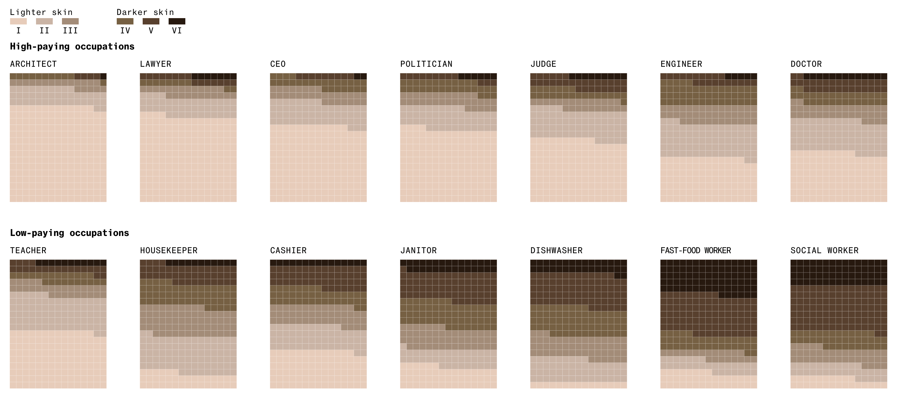

# Exercise: Types of Failures in Generative AI

In this exercise you'll find several examples of Generative AI, along with discussion questions for each example. The purpose of this discussion section is to examine how and why generative models make mistakes.

Each example will follow the following pattern:

1. Your instructor will briefly describe the example.
2. You'll be broken into small groups to discuss the example and the associated questions.
3. We'll all come back together and have a full-class discussion. 

## Error 1: Generative AI and The -isms

Generative AI has faced substantial problems with racism, sexism, and more. Here are two examples of this phenomenon, though you may be aware of others:

### Bloomberg Analysis: Racial and Gender Bias by Profession

Source: [https://www.bloomberg.com/graphics/2023-generative-ai-bias/](https://www.bloomberg.com/graphics/2023-generative-ai-bias/)

Bloomberg prompted Stable Diffusion to generate pictures of people with various professions, then categorized the output based on skin tone and perceived gender. They found that:

> The analysis found that image sets generated for every high-paying job were dominated by subjects with lighter skin tones, while subjects with darker skin tones were more commonly generated by prompts like “fast-food worker” and “social worker.”

and

> For each image depicting a perceived woman, Stable Diffusion generated almost three times as many images of perceived men. Most occupations in the dataset were dominated by men, except for low-paying jobs like housekeeper and cashier.

### Research Published in *Nature*: Racially Biased Medical Advice

Source: [https://www.nature.com/articles/s41746-023-00939-z](https://www.nature.com/articles/s41746-023-00939-z)

Researchers found that:

> We assessed four large language models with nine different questions that were interrogated five times each with a total of 45 responses per model. All models had examples of perpetuating race-based medicine in their responses.

### Discussion Questions:

* What might the training data for these systems consist of?
    * What kind of data is used?
    * Where did the data come from?
    * How was it collected and evaluated?
    * When was it produced?
* Where do these biases come from?
    * Are they unique to ML models?
* What steps might be taken to mitigate such errors?
    * Try to think of at least 3 tactics: There are no silver bullets.

## Case 2: Hallucination

Sometimes generative models make stuff up. "Hallucination" has become the term of art used to describe this phenomenon. Sometimes hallucinations are a big problem, here's a quote from a lawsuit filed by The New York Times vs Microsoft and OpenAI (https://admin.bakerlaw.com/wp-content/uploads/2024/01/ECF-1-Complaint-1-1.pdf)[https://admin.bakerlaw.com/wp-content/uploads/2024/01/ECF-1-Complaint-1-1.pdf]:

> Defendants are aware that their GPT-based products produce inaccurate content that is falsely attributed to The Times and yet continue to profit commercially from creating and attributing inaccurate content to The Times. As such, Defendants have intentionally violated 15 U.S.C § 1125(c).

Here, the model cited non-existent NYTimes journalism as a source for fictitious information, and they got sued.

Hallucination also occurs, for example, when language models produce incorrect results to math problems ([https://arstechnica.com/science/2023/05/when-it-comes-to-advanced-math-chatgpt-is-no-star-student/](https://arstechnica.com/science/2023/05/when-it-comes-to-advanced-math-chatgpt-is-no-star-student/)). 

There are countless examples.

### Discussion Questions:

* Are you aware of any other examples of generative models "hallucinating"?
* Why do you think hallucinations occur?
    * If the training data consumed were 100% factual and accurate, would hallucination still occur?
* Can you think of any situations where "hallucination" is the desired outcome?
* How might you decrease or eliminate hallucinations?

## Case 3: Regurgitation and Overfitting

Generative Models are known to sometimes return exact, or nearly exact, copies of their training data inputs. Here's an example from IEE Spectrum: (https://spectrum.ieee.org/midjourney-copyright)[https://spectrum.ieee.org/midjourney-copyright]

> Ultimately, we discovered that a prompt of just a single word (not counting routine parameters) that’s not specific to any film, character, or actor yielded apparently infringing content: that word was “screencap.” The images below were created with that prompt.

The aforementioned NYTimes lawsuit also contains examples of ChatGPT producing verbatim copies of NYTimes articles. 

In addition to intellectual property questions, similar behavior has raised privacy questions. For example, here's an article from the New York Times [https://www.nytimes.com/interactive/2023/12/22/technology/openai-chatgpt-privacy-exploit.html](https://www.nytimes.com/interactive/2023/12/22/technology/openai-chatgpt-privacy-exploit.html):

> My contact information was included in a list of business and personal email addresses for more than 30 New York Times employees that a research team, including Mr. Zhu, had managed to extract from GPT-3.5 Turbo in the fall of this year. With some work, the team had been able to “bypass the model’s restrictions on responding to privacy-related queries,” Mr. Zhu wrote.

> [...]

> OpenAI released its fine-tuning interface for GPT-3.5 last August, which researchers determined contained the Enron dataset. Similar to the steps for extracting information about Times employees, Mr. Zhu said that he and his fellow researchers were able to extract more than 5,000 pairs of Enron names and email addresses, with an accuracy rate of around 70 percent, by providing only 10 known pairs.

### Discussion Questions:

* Why might models produce exact or near exact copies of their training data?
    * Is there anything about training that could make this more or less likely?
* Does this behavior create legal liability for end users?
* How substantial do you think the privacy concerns are?
    * Where are AI firms getting their training data?
* How could you mitigate or eliminate this behavior?

## Error 4: Malicious Use

This one isn't exactly an "error" ... but it is a problem. Generative AI is somewhat more "general" than previous kinds of models, which means it can be used for a lot of "off label" or unanticipated purposes. Here's a short list of problematic things that GenAI has been used to do:

* Create fake pornographic images of Taylor Swift (and countless others) [https://www.404media.co/taylor-swift-deepfakes-ai-generated-porn/](https://www.404media.co/taylor-swift-deepfakes-ai-generated-porn/)

* Create falsified audio of Joe Biden asking people not to vote [https://apnews.com/article/biden-robocalls-artificial-intelligence-new-hampshire-texas-a8665277d43d05380d2c7594edf27617]
(https://apnews.com/article/biden-robocalls-artificial-intelligence-new-hampshire-texas-a8665277d43d05380d2c7594edf27617)

* Create garbage tabloid websites that have great SEO and generate ad revenue [https://www.technologyreview.com/2023/04/04/1070938/we-are-hurtling-toward-a-glitchy-spammy-scammy-ai-powered-internet/](https://www.technologyreview.com/2023/04/04/1070938/we-are-hurtling-toward-a-glitchy-spammy-scammy-ai-powered-internet/)

* Automate Phishing and Malware [https://krebsonsecurity.com/2023/08/meet-the-brains-behind-the-malware-friendly-ai-chat-service-wormgpt/](https://krebsonsecurity.com/2023/08/meet-the-brains-behind-the-malware-friendly-ai-chat-service-wormgpt/)

### Discussion Questions

* Are you familiar with any other malicious uses?
    * Are there any that you're particularly worried about?
* Do model providers have an obligation to prevent malicious uses?
* To what extent can AI firms prevent their products from being used maliciously?
    * What tactics could they use to stop some of the above examples?

